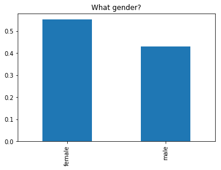
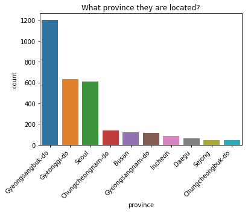
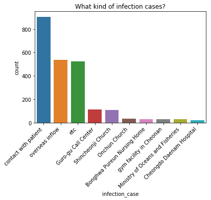
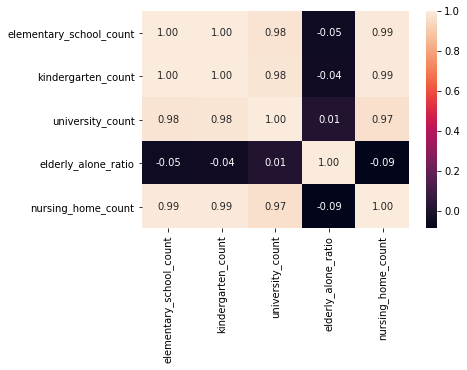
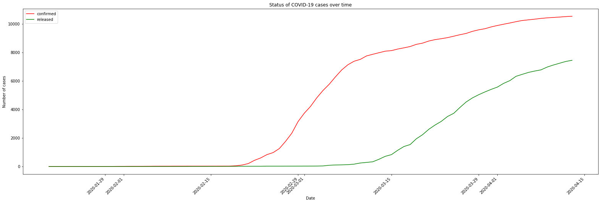
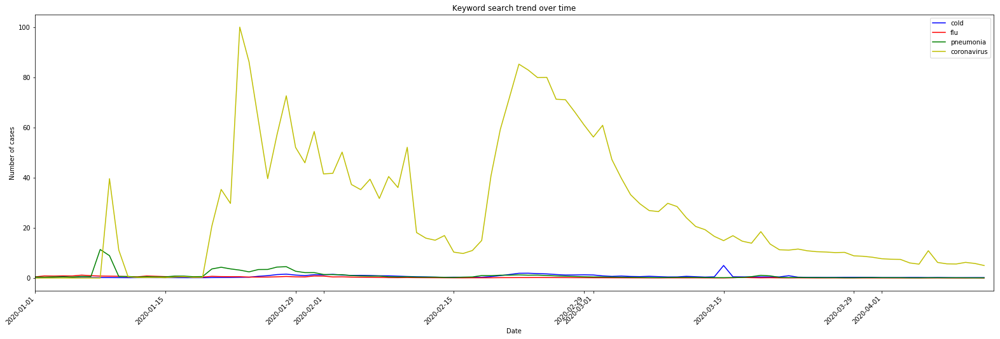
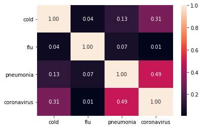
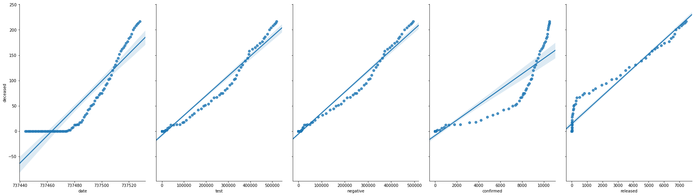

<!DOCTYPE html>
<html>
<body>
 
<h1>An overview on the COVID-19 KCDC dataset and some insights<h1>

<h2>Overview</h2>
COVID-19 has infected more than 10,000 people in South Korea. KCDC (Korea Centers for Disease Control & Prevention) announces the information of COVID-19 quickly and transparently. This structured dataset is collected in line with the report materials of KCDC and local governments. Intuitively, we are collecting insigts into the dataset by answering some critical questions.

<h3>Acknowledgements</h3>
Thanks sincerely to all the members of KCDC and local governments.
Source of data: KCDC (Korea Centers for Disease Control & Prevention)
https://www.kaggle.com/kimjihoo/coronavirusdataset

<h2>Data preparation</h2>
Data should be checked for the following items:
 
 - Each column is a variable, and each row is an individual
  
 - Number of columns and rows in each of datasets
  
 - Missing data, and whether those missing data should be imputed or removed
  
 - Data types check (if they are loaded as the datatype as we expected)
  
 - Exploratory plots like bar charts and histograms to better understand the data
  

 <h3>Imputing missing data</h3>
I first check for the missing value in the basic table called PatientInfo which is the general epidemiological data of COVID-19 patients in South Korea. There was no all missing columns, but there exist columns with more than 75 percent but not fully null. We are going to impute numerical value simply with the mean value. However, those columns are not important for the later analysis here and we do this as a good practice. For the categorical missing values, I first cerated dummy variables for each of the categories, then replaced the missing values by the categories with the highest frequency among the others. The codes are all included in the jupyter notebook under Imputing missing data section.  

<h3> Data type check </h3>
Sometimes, the expected datatypes of the read dataset are not teh same as what we expected. For example, date and time data columns are commonly loaded as object type. The object type will prevent us from working or visualizing this column for time-series analysis. So, we need to change that object datatype into date/time datatype before any further analysis. The codes are all included in the jupyter notebook under Data type check section.   

<h3> Exploratory plots </h3>
I explored some data field as necessary, and used my findings to solve the questions in the next section.
One of the intersting insigts is that how the virus has affected people in different ages. As you can see in the following picture that indicates top 20 age groups who affected more with the virus, people born in 1995 and 1996 have the highest number of incidents, which indicates the virus has affected young people in a a big deal.

In terms of gender, women (1798) have overtaken men (1420).

There are also datasets on how the virus is distributed between different provinces in South Koeara. In the folloiwng plot, top ten provinces are shown with their order of engagemnet. The popolation of these provinces is presumabely an important factor in the distribution, however, there are some exception such as Chungcheongbuk-do province which has the highest number of incidents while it has just 2.67 percent of the population of South Korea, and Gyeonggi-do with the highest percentage of population (13.1 percent) has the half number of cases in compare with Gyeonggi-do.   

<h2>Insights and Questions</h2>
Some thoughts on insights and specific questions regarding the South Korea's COVID-19 dataset are the following:  

(1) What are the sources of infection? 
 
(2) How different levels of community interactions are related to each other? 
 
(3) How infected and recovered cases change over the last month?
 
(4) How daily web searches on COVID-19, cold, or flu are related?
 

For question 1, the relevant data has been analyzed and the top ten reasons are plotted as follows. As obserevd, the most effective way of virus transformation is by close contact with the patient, and that is why one of the most impotant recommendation to everyone is to hold social distance and also stay in home quarantine when are affected by the virus. The second important factor is traveling, and that is why all governments planned to check incomming travelers against COVID-19 signs and ask all those travelers to stay in quarantine for at least 14 days regardless.

The second question is important since we can find out which one of the big communities were more effective to spread the virus, especially becasue we can explore the correlation between different comminities as well. For instance, a kindergarden and elemntary schools can spread virus to each other (be correlated in the case numbers) since a family have yound children in both kindergarden and elemntary schools and they can tranfer virus to each other and unfortunately there is little or no sign at the early days of infection and there is less likely to prevent the virus spread. As obsereved, the spread of virus at nursing homes is also strongly correlated with school communitites. However, those elder people who live alone and not in a nursing home are much less affected as expected.

Question 3 clarifies how the breakdown is eliminated and is a very important property to consider for each country to find out if their non-essential businesses should stay shut-down or it is the time to return to a normal situation. In this plot, we can observe the infections and recoveries over the course of a month. We can see a flat line in mid April 2020 which is a good sign that the cases are not changing over time anymore.

Furthermore, as we all know, the signs of COVID-19 is so close to other common seasonal disease such as cold, flu and pneumonia. It si interesting to explore how frequently people were searching around the keywords of those diseases. We can also observe in which time poeple were more clear to distinguish between COVID-19 and other simliar diseases and hence to be more self-aware of the specific signs of COVID-19. Also, we can observe that the searches on COVID-19 keywords are decreased as the breakdown is reduced, and they are consistent. This is an interesting observation since it indciates less cases are happening and people do not need to learn about the COVID-19 signs in case they are affected. It also confrims the global less number of confirmed infection cases. This trend data is collected by the keywords searched in NAVER which is one of the largest portals in South Korea.

We also extracted the correlation between the searched keywords as follows:

The above picture indicates the closeness between the signs of these infections and how that similarity might make it harder for people to distinguish between them. As observed and expected, there is high similary between COVID-19 and pneumonia (0.49 coefficient) that might cause mistake to distinguish between them if we have either of them.  

<h2>Predictive modeling</h2>

Here, we want to make prediction on the number of deceased cases, using the collected data on date, number of COVID-19 tests, confirmed cases, negative cases, and recoveries. For this, we fit a linear regression model on the training data and will predict the number of deceased cases in test data. By splitting 86 datapoints into 70 percent training data and 30 percent test data, and random state equal 42, the model could predict the test data with Rsquared=0.99 and mean squared error=2.59. Higher volume of dataset will be definitely helpful to better fit the model. 

In the following plot we visually observe how much each pair of independent variables of dataset (date, number of COVID-19 tests, confirmed cases, negative cases, and recoveries) is correlated with the depenedent vraiable (number of deceased cases).   

</body>
</html>

